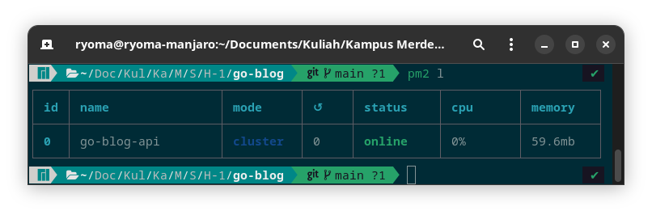

# Go Blog

Simple REST API Application built for learning.

Contains about several entities such as User, Article and Comment.

For more this API documentation, see [Go-Blog API Postman Documenter](https://documenter.getpostman.com/view/23133618/VUxSr5QK)

## Installation

First step is downloading this repository

```sh
# using git clone
git clone https://github.com/ryomario/go-blog-app.git
```

Next is the installation

```sh
# enter the project directory
cd go-blog-app

# install nodemon & pm2 globally
npm i -g nodemon pm2

# install all the packages that the application needs
npm i
```


## Usage

### `npm run dev`

Use this command to ease the development process. This command will execute nodemon to run the file `app.js`. 

Nodemon is a tool that helps develop Node.js based applications by automatically restarting the node application when file changes in the directory are detected.

You can read [Full Documentation nodemon](https://github.com/remy/nodemon#nodemon)

### `npm start`

Use this for just start the app without watching any changes.

### `npm run pm2`

Before use this command you have to change the `pm2.json` file first

https://github.com/ryomario/go-blog-app/blob/98bf69b6796771ff58d28a83cb03beb4af56fb3d/pm2.json#L4

> on the $4^{th}$ line to be precise in the `pwd` field

Change the value with the static location of the project directory.

Now, start command `npm run pm2` and then the Process Manager (PM2) will start the project. The successful process will look like below



PM2 is a daemon process manager that will help you manage and keep your application online 24/7. Check this [PM2 Homepage](https://pm2.keymetrics.io/)


## About

This project is only for learning
